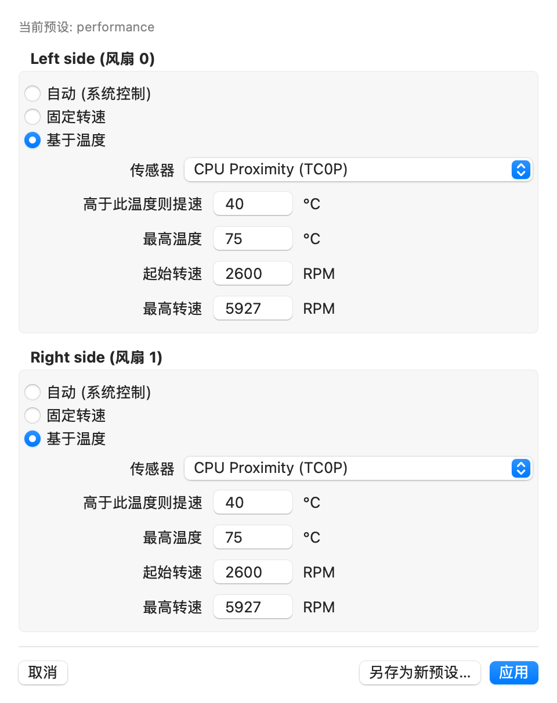

# FanControl

> Local-first fan curve control for Apple Silicon Macs, with per-fan presets and hardware-aware safety guardrails.

[中文版](README.zh-CN.md) · [Safety](docs/SAFETY.md) · [Compatibility](docs/COMPATIBILITY.md) · [Privacy](docs/PRIVACY.md)

[Signed distribution guide](docs/DISTRIBUTION.md)



## Status

FanControl is an experimental open-source project focused on Apple Silicon Macs
with physical fans. It can read fan data and,
after an explicit administrator authorization, apply manual or temperature-based
fan targets through a deliberately restricted helper. The project is not an
Apple product, and its releases are currently **ad-hoc signed, not notarized**.

Please read [Safety](docs/SAFETY.md) before controlling a fan. We especially
need hardware reports from M1, M2, M4, and M5 Mac owners.

## What it does

- Native menu-bar controls for temperature, RPM, presets, and start-at-login.
- Per-fan automatic, fixed-RPM, or temperature-curve modes.
- Shared configuration for the app and optional CLI service.
- Local-only operation: no account, telemetry, crash reporting, or network
  service. See [Privacy](docs/PRIVACY.md).
- A narrow SMC write surface: only fan-control keys are accepted.
- A non-zero target RPM is rejected unless it is inside the fan's own reported
  minimum and maximum range.

## Hardware status

Apple Silicon is the primary target. The code also retains a verified Intel/T2
compatibility path and builds as a universal `x86_64` + `arm64` app. That is
not a promise that every Mac exposes compatible SMC keys.

| Model | macOS | Maintainer-reported result |
| --- | --- | --- |
| Mac15,6 (M3 Pro) | 27.0 | Dual-fan read, presets, restore-auto |
| MacBookPro15,1 (T2) | 15.7 | Read, manual control, restore-auto |
| M1 / M2 / M4 / M5 | — | Not yet verified |

See the full [compatibility policy](docs/COMPATIBILITY.md) and use the
hardware issue template to add a result.

## Build from source

Requirements: macOS 13 or later and Xcode Command Line Tools.

```bash
git clone https://github.com/gmaxio/fancontrol.git
cd fancontrol
zsh build_app.sh
open FanControl.app
```

The app can read local SMC values without installation. Changing fan behaviour
requires its separately installed, root-owned helper. The full distribution
bundle produced by `build_app.sh` includes the CLI and installer:

```bash
unzip fancontrol-dist.zip
cd fancontrol-dist
zsh install.sh
```

Do not bypass macOS security checks with blanket quarantine-removal commands.
Build from source if you want to inspect the exact helper being installed. The
planned signed/notarized release workflow is documented in
[docs/DISTRIBUTION.md](docs/DISTRIBUTION.md).

## Everyday use

Open the app, choose a fan mode, make one bounded change, and observe the
result. The optional CLI provides the same configuration and can run a
background temperature curve:

```bash
fancontrol status
fancontrol fans
fancontrol presets
fancontrol run       # Ctrl-C returns control to macOS automatic mode
fancontrol auto      # return all fans to automatic control
```

Never run another fan-control utility at the same time. A normal app or CLI
exit attempts to restore automatic control; a forced kill or power loss cannot
guarantee cleanup. The macOS hardware protections remain the final safeguard.

## Removing it

The uninstall script does nothing without explicit confirmation:

```bash
zsh uninstall.sh --yes
zsh uninstall.sh --yes --purge-data  # also remove presets, preferences, logs
```

## Contributing and security

- Read [CONTRIBUTING.md](CONTRIBUTING.md) for issue and pull-request guidance.
- See the public [roadmap](ROADMAP.md) for the work needed before a stable release.
- Report privilege or unsafe-write vulnerabilities privately as described in
  [SECURITY.md](SECURITY.md).
- Do not commit build artifacts, logs, private configuration, credentials, or
  device serial numbers.

FanControl is currently maintained by **gmaxio**, the project's creator and
sole maintainer. Compatibility reports and focused pull requests are welcome.

## License and acknowledgements

FanControl is licensed under [GPL-2.0-or-later](LICENSE). `smc.c` is derived
from the GPL-licensed `smc-command` component of
[smcFanControl](https://github.com/hholtmann/smcFanControl); see [NOTICE](NOTICE)
for attribution. The project also cites
[Stats](https://github.com/exelban/stats) as public SMC-behaviour research.
