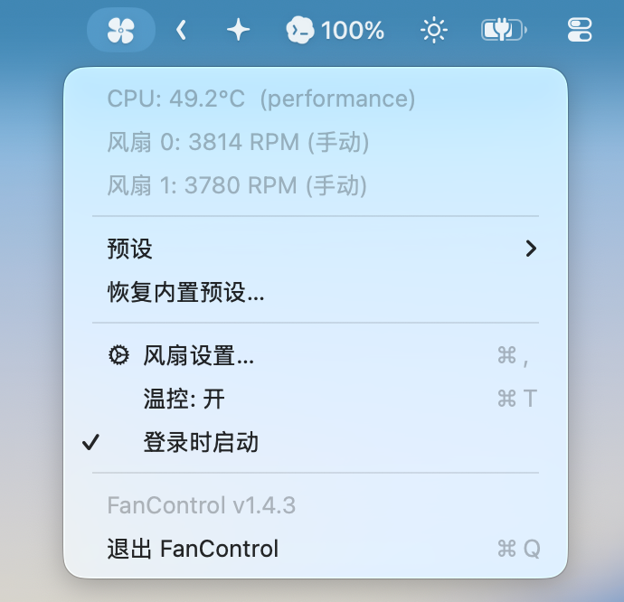
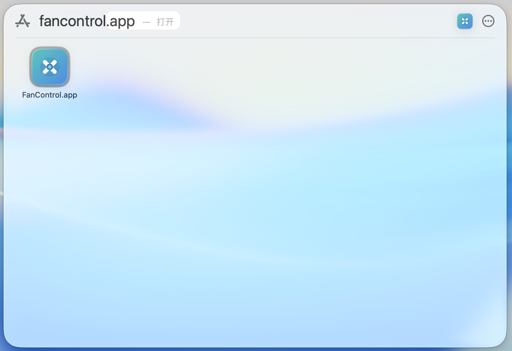

# FanControl

> 面向 Apple Silicon Mac 的本地优先风扇曲线工具，提供独立风扇预设与基于硬件范围的安全约束。

[English](README.md) · [安全说明](docs/SAFETY.md) · [兼容性](docs/COMPATIBILITY.md) · [隐私](docs/PRIVACY.md)

[签名与公证发布说明](docs/DISTRIBUTION.md)

## 项目状态

FanControl 是主打 Apple Silicon Mac 的实验性开源项目。它可以读取风扇数据；只有在你明确授权管理员权限后，才会通过一个受限的系统组件写入风扇控制值。它不是 Apple 产品，当前构建为**临时签名（ad-hoc signed），尚未公证（notarized）**。

[v0.1.0-preview Release](https://github.com/gmaxio/fancontrol/releases/tag/v0.1.0-preview) 提供可选的学习/测试安装包。首次打开可能会触发 Gatekeeper 提示；请先阅读[预览包下载说明](docs/DISTRIBUTION.md#using-the-preview-downloads)。

在实际调速前，请阅读[安全说明](docs/SAFETY.md)。目前尤其需要 M1、M2、M4、M5 机型的兼容性反馈。

## 使用界面

以下截图由维护者提供，展示了在带实体风扇的 Mac 上使用 FanControl 的菜单栏流程和应用包。具体文字、RPM、温度与布局会因构建版本和硬件而变化。



*菜单栏面板显示 CPU 温度、两个风扇读数、手动模式、预设、风扇设置、温控和登录启动。*



*在 Finder 中打开 FanControl.app。FanControl 设计为菜单栏工具，不依赖传统的主窗口。*

> 第一张截图中的界面版本显示为 `FanControl v1.4.3`，这里仅用于展示 UI，不代表所有 Mac 机型都兼容，也不代表当前公开预览版的版本号。

## 能做什么

- 原生菜单栏查看温度、RPM、预设和登录启动状态。
- 每个风扇可使用系统自动、固定 RPM 或基于温度的曲线。
- App 与可选 CLI 共用本地配置。
- 不需要账号；不含遥测、崩溃上报、广告或网络服务。
- 特权组件只允许写风扇相关的 SMC 键。
- 非零目标 RPM 必须落在硬件报告的最小/最大范围内；无法读取范围时会拒绝写入。

## 已验证与待验证机型

| 机型 | macOS | 维护者报告结果 |
| --- | --- | --- |
| Mac15,6（M3 Pro） | 27.0 | 双风扇读取、预设、恢复自动 |
| MacBookPro15,1（T2） | 15.7 | 可读取、手动控制、恢复自动 |
| M1 / M2 / M4 / M5 | — | 尚未验证 |

Apple Silicon 是主要目标；项目同时保留已验证的 Intel/T2 兼容路径。「通用二进制」只说明代码可为 x86_64 与 arm64 编译，不代表所有机型都具有相同的 SMC 键。详细边界见[兼容性说明](docs/COMPATIBILITY.md)。

## 从源码构建

需要 macOS 13+ 与 Xcode Command Line Tools：

```bash
git clone https://github.com/gmaxio/fancontrol.git
cd fancontrol
zsh build_app.sh
open FanControl.app
```

App 可直接读取本机 SMC 数据。要改变风扇行为，需要另行安装 root 所有的受限控制组件。`build_app.sh` 也会生成含 CLI 与安装脚本的 `fancontrol-dist.zip`：

```bash
unzip fancontrol-dist.zip
cd fancontrol-dist
zsh install.sh
```

请不要用“一键移除隔离属性”等方式绕过 macOS 安全提示。希望核对安装内容时，建议自行从源码构建。未来签名与公证版本的流程见[签名与公证发布说明](docs/DISTRIBUTION.md)。

## 预览安装包

Release 中提供两个可选压缩包：

- `FanControl.app.zip`：菜单栏 App 与只读 SMC 工具。
- `fancontrol-dist.zip`：App、CLI、安装脚本和卸载脚本。

它们仅用于学习和测试，使用临时签名且尚未公证；完整分发包只有在你明确确认管理员权限后才会安装特权组件。使用前请核对 Release 中的 SHA-256，并按照[预览包下载说明](docs/DISTRIBUTION.md#using-the-preview-downloads)逐个放行应用。

## 日常使用与卸载

先从自动模式开始，每次只改一个小参数并观察结果。不要同时运行另一款风扇控制工具。

```bash
fancontrol status
fancontrol fans
fancontrol run       # Ctrl-C 时尝试恢复系统自动控制
fancontrol auto      # 将所有风扇交还给系统
zsh uninstall.sh --yes
```

正常退出会尝试恢复自动控制；强制结束进程或断电无法保证清理。macOS 自身的硬件保护机制始终是最后防线。

## 参与贡献与安全报告

- 贡献规范见 [CONTRIBUTING.md](CONTRIBUTING.md)。
- 稳定版之前的重点工作见公开 [Roadmap](ROADMAP.md)。
- 涉及权限扩大、非风扇 SMC 写入或安全边界的问题，请遵循 [SECURITY.md](SECURITY.md) 私下报告。
- 请不要提交构建产物、日志、配置、密钥或设备序列号。

FanControl 目前由项目创建者兼唯一维护者 **gmaxio** 维护，欢迎提交机型兼容报告与范围清晰的 Pull Request。


## 许可证与致谢

项目采用 [GPL-2.0-or-later](LICENSE)。`smc.c` 基于 GPL 许可的 [smcFanControl](https://github.com/hholtmann/smcFanControl) 中 `smc-command` 组件改造，归属说明见 [NOTICE](NOTICE)。项目也引用 [Stats](https://github.com/exelban/stats) 作为公开的 macOS SMC 行为研究资料。
